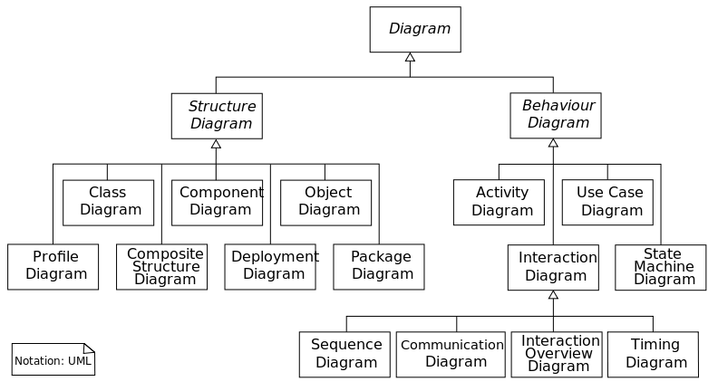

# 7. gyakorlat

## Objektumelvű tervezés &ndash; UML-diagramok

* Az UML (Unified Modeling Language) a nevéhez hűen egy szabványos modellező nyelv
* Alapvető célja egy összetettebb rendszer tervezését illetve dokumentálását segíteni
* Nem kizárólag programozási alkalmazásai vannak
* Alapvetően sok mindent megenged, rugalmas, a szemléletesség a cél
* Létezik végrehajtható változata, esetleg olyan, amiből kód generálható (modell-vezérelt fejlesztés), ekkor persze kevésbé rugalmas
* Adatbázis-tervezésre is alkalmas
* Önmagában kevés, nem elég kifejező, de más eszközökkel társítva hasznos. Egységessége miatt könnyen hozza a feleket azonos platformra

### Típusai

* Statikus nézőpont &ndash; Strukturális (Structure)
	* Komponens (Component)
	* Osztály (Class)
	* Összetett struktúra (Composite Structure)
	* Telepítési (Deployment)
	* Objektum (Object)
	* Csomag (Package)
	* Adatbázis (Database)
* Dinamikus nézőpont &ndash; Viselkedési (Behavior)
	* Használati eset (Use Case)
	* Aktivitás (Activity)
	* Állapotgép (State Machine)
	* Szekvencia (Sequence)
	* Interakciós áttekintő (Interaction Overview)
	* Időzítő (Timing)
	* Kommunikációs (Communication)

* Egy UML osztálydiagramon szemléltetve (azaz ez egy meta-diagram)
	* 
* Osztálydiagram
	* Nem feltétlenül az implementációt követik (elnevezés, többszörös öröklődés, stb)
	* Az osztályok közti hierarchia mellett a köztük létező kommunikációt is tudja ábrázolni annak statikus aspektusából
	* 
* Objektumdiagram
	* Egy osztály egy lehetséges példánya
	* Konkrét értékekkel
	* Példák, szemléltetés, érdekesebb esetek
	* 
* Csomagdiagram
	* Nagy rendszerek funkciók szerinti csoportosítása
	* 
Komponensdiagram
	* Nagy rendszerek felépítés szerinti csoportosítása
	* 
* Használati esetek diagramja
	* Tervezés első fázisához
	* Megrendelővel való egyeztetésekhez alkalmas, mert közérthető, (még) nem az implementációhoz kötött
	* Ez csak egy diagram, ehhez írásban is hozzáteszünk, ez a használatieset-modell
	* Aktorok: a program felhasználóinak egy-egy csoportját reprezentáló szereplő
	* Gyakorlatilag a menüpontok szerepelnek benne
	* 
* Szekvenciadiagram
	* A program futásának kehetséges forgatókönyvei
	* Konkrét objektumok (nem osztályok) közti kommunikáció, hívási sorrend
	* Példaként szolgál, segíti az implementációt (vagy nem)
	* 
* Aktivitásdiagram
	* Kicsit a használatieset- és a szekveciadiagram keveréke (munkafolyamat &ndash; workflow)
	* 
* Állapotátmenet-diagram
	* Jól ki lehet vele fejezni a lehetőségeket (ez nem egy konkrét példa a futtatásra, hanem minden lehetséges működésbeli lehetőség szerepel benne)
	* Mikor milyen műveletet szabad végezni és mi a hatása
	* Milyen állapotba milyen művelet visz, ott milyen invariánsok igazak
	* Arra alkalmas eszközzel ebből tudnak kódot generálni leginkább, ilyenkor természetesen szükséges hogy a modell minél teljesebb és pontosabb legyen
	* 

### Feladatok (use case + class diagram)

1. Draw a class diagram of a zoo. A zoo has a collection of Animals, that is called animals. An Animal can be a Lion or a Fish. Lion implements the SoundSource interface thus it is a member of the AnimalWithVoice class. Every animal has a getSpecies() and a toString() public method. Additionally classes that implement SoundSource must have a getVoice() method. Species is an enumerated type, that is the return type of getSpecies(), while toString() and getVoice() return String values. Animals also have a name attribute and a getName() : String method.
2. Készítsünk olyan programot, melyben síkidomokat lehet kezelni. Egy síkidomnak van területe és kerülete, lehet konvex és konkáv. A síkidom vagy kör, vagy sokszög. A sokszög lehet szabályos és nem szabályos. A felületre fel lehet dobálni az alakzatokat, amit kaptunk lehet képként menteni, XML-ben menteni (egy jól olvasható listát ad a síkidomokról) és a program saját formátumával is elmenthetjük, amiből később visszatölthetünk.
